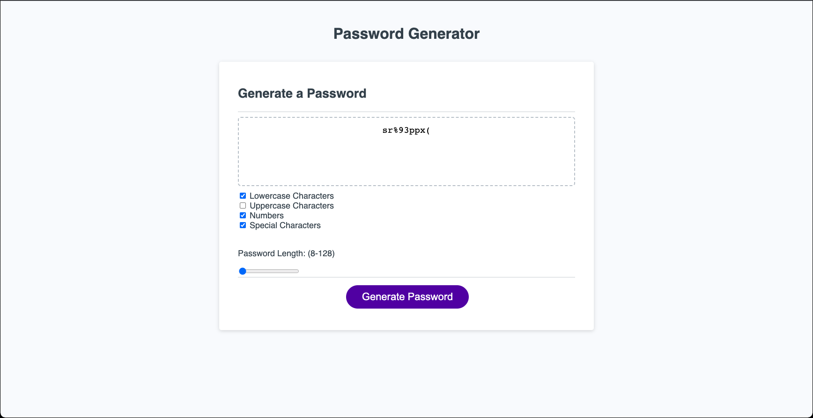

# Password Generator Demo

## Description

This project further demonstrates the understanding of the syntax and flow used in JavaScript, allowing practice of taking values input into HTML elements, bringing said values into the JavaScript and using them to define what output the user will see on the screen.

## Installation

https://judemdonahue.github.io/Password-Generator/

## Usage

The user is brought to the webpage and is given options to define the characteristics of their password. These options include: Lowercase, uppercase, numbers, special characters, and the length of their password. Upon selecting desired options and clicking the 'Generate Password' button, the user will be displayed their randomly generated password.

## License

MIT License

